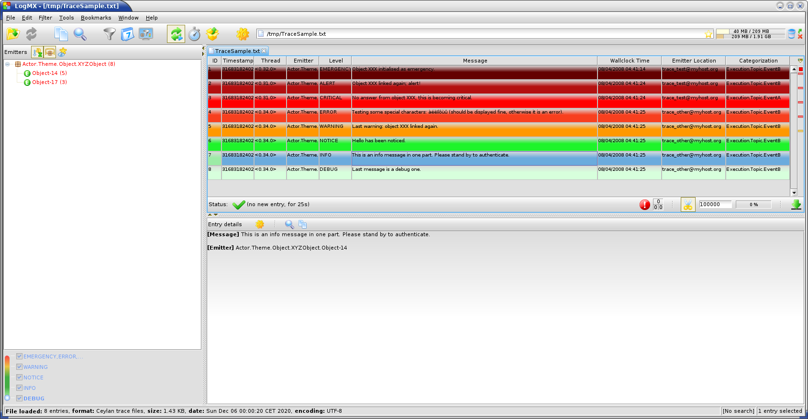

.. _Top:

.. title:: Welcome to the Ceylan-Traces documentation

.. comment stylesheet specified through GNUmakefile

.. role:: raw-html(raw)
   :format: html

.. role:: raw-latex(raw)
   :format: latex

.. comment Would appear too late, can only be an be used only in preamble:
.. comment :raw-latex:`\usepackage{graphicx}`
.. comment As a result, in this document at least a '.. figure:: XXXX' must
.. exist, otherwise: 'Undefined control sequence \includegraphics.'.

:raw-html:``

:raw-html:`

<em>Traces documentation</em> <a href="http://traces.esperide.org">browse latest</a> <a href="https://olivier-boudeville.github.io/Ceylan-Traces/index.html">browse mirror</a> <a href="traces.pdf">get PDF</a> <a href="#traces_top">go to top</a> <a href="#traces_bottom">go to bottom</a> <a href="mailto:about(dash)traces(at)esperide(dot)com?subject=[Ceylan-Traces]%20Remark">email us</a>

`

:raw-html:`
</img>
`
:raw-latex:`\includegraphics[scale=0.35]{traces-title.png}`

===============================================
Technical Manual of the ``Ceylan-Traces`` Layer
===============================================

:Organisation: Copyright (C) 2010-2020 Olivier Boudeville
:Contact: about (dash) traces (at) esperide (dot) com
:Creation date: Sunday, August 15, 2010
:Lastly updated: Wednesday, October 21, 2020
:Status: Work in progress
:Version: 0.9.14
:Dedication: Users and maintainers of the ``Traces`` layer.
:Abstract:

	The role of the `Traces <http://traces.esperide.org/>`_ layer (part of the `Ceylan <https://github.com/Olivier-Boudeville/Ceylan>`_ project) is to provide Erlang applications with advanced trace services, so that the user can efficiently log, browse and search through detailed runtime messages that may be emitted concurrently (i.e. in a parallel, distributed way).

	We present here a short overview of these services, to introduce them to newcomers.
	The next level of information is to read the corresponding `source files <https://github.com/Olivier-Boudeville/Ceylan-Traces>`_, which are intensely commented and generally straightforward.

.. meta::
   :keywords: Traces, log, browse, emit, layer, generic, general-purpose, helper code, library, layer

:raw-latex:`\pagebreak`

.. contents:: Table of Contents
	:depth: 3

:raw-latex:`\pagebreak`

--------
Overview
--------

This layer is in charge of providing `Erlang <http://erlang.org>`_ programs with the means of emitting, collecting, storing and browsing *applicative traces* (i.e. logs).

For that, various components have been designed and implemented, such as trace aggregator, emitter, listener, supervisor, etc.

They collectively constitute the `Traces <http://traces.esperide.org/>`_ layer, whose prerequisites are the `WOOPER <http://wooper.esperide.org/>`_ layer (for object-oriented primitives) and the `Myriad <http://myriad.esperide.org/>`_ layer (for many lower-level services; itself a prerequisite of WOOPER).

The main purpose of this **Traces** layer is to provide adequate traces for distributed systems (a rather critical feature in order to debug in these difficult contexts), and to ease their study and browsing. A few back-ends are available for that, from the direct reading of the (raw) trace files to considerably more user-friendly solutions, such as the generation of PDF reports or the use of our more advanced trace format, which can be read by commercial tools such as `LogMX <http://www.logmx.com/>`_ [#]_.

.. [#] The Ceylan-Traces layer defined a trace format of its own, supported by our Java-based parser for LogMX.

.. _`trace levels`

.. _`trace severity`:

------------
Trace Levels
------------

There are six built-in levels for trace channels, of increasing severity:

===================== ============
Trace Severity        Mapped Level
===================== ============
``debug``             6
``trace``             5
``info``              4
``warning``           3
``error``             2
``fatal``             1
===================== ============

There is also an addition trace severity, ``void``, that designates traces that shall be muted in all cases.

Its purpose is to provide another means of muting/unmuting some traces, instead of commenting out/uncommenting said traces.

:raw-latex:`\pagebreak`

.. _`trace content`:

-------------
Trace Content
-------------

The traces corresponding to an execution are represented as an wallclock-time ordered stream of trace messages.

These traces are possibly exchanged over the network or stored in a file, whose extension is conventionally ``.traces``.

For example the traces for a test named ``my_foobar_test`` are typically stored in a ``my_foobar_test.traces`` file, generated by the trace aggregator in the directory from which the corresponding test was launched.

Following data is associated to a given trace:

 #. **technical identifier of the emitter**, as a string (ex: ``<9097.51.0>`` for the PID of a distributed Erlang process)
 #. **name of the emitter** (ex: ``"Instance tracker"``)
 #. **dotted categorization of the emitter** (ex: ``"Core.Tracker.Instances"``); here for example the emitter is an element of the service in charge of the instances, which itself belongs to the tracker services, which themselves belong to the (even more general) core services
 #. **application-level timestamp** (ex: operation count, relative tick, absolute timestep, or any complex, application-specific timestamp, etc.), possibly ``none``, or ``undefined`` if not applicable (ex: a simulation that would not be started yet)
 #. **wall-clock timestamp**, in the ``"Year/Month/Day Hour:Minute:Second"`` format (ex: ``"2016/6/10 15:43:31"``); this is an emitter-side timestamp (hence not related to the wallclock time known of the trace aggregator)
 #. **emitter location**, as a string (ex: the name of the Erlang node, possibly including the name of the application use case, of the user and of the host; ex: ``my_foobar_test_john@hurricane.org``)
 #. **dotted categorization of the trace message** itself (ex: ``MyApp.MyTopic.MyTheme``)
 #. **severity of the trace message** (mapped to an integer level, as discussed above)
 #. the **trace message** itself, an arbitrary text of arbitrary length

--------------
Trace Emission
--------------

The following header is to be included so that an Erlang process can send traces::

 -include("class_TraceEmitter.hrl").

or, better, in an OTP-compliant fashion::

 -include_lib("traces/include/class_TraceEmitter.hrl").

This process can be a standalone module (ex: a test or an application launcher, see `trace_management_test.erl <https://github.com/Olivier-Boudeville/Ceylan-Traces/blob/master/test/trace_management_test.erl>`_) or, more frequently, it might correspond to a WOOPER (active) instance, in which case it shall inherit, directly or not, from ``class_TraceEmitter`` (see `class_TestTraceEmitter.erl <https://github.com/Olivier-Boudeville/Ceylan-Traces/blob/master/test/class_TestTraceEmitter.erl>`_ for a complete example of it).

From member methods
===================

Then sending-primitives can be used, such as::

  ?info("Hello world!")

or::

  ?info_fmt("The value ~B is the answer.",[MyValue])

Many API variations exist (see `class_TraceEmitter.hrl <https://github.com/Olivier-Boudeville/Ceylan-Traces/blob/master/include/class_TraceEmitter.hrl>`_), to account for the various `trace content`_, contexts, etc., but ``?T(Message)`` and ``?T_fmt(MessageFormat,MessageValues)``, for ``T`` corresponding to a `trace severity`_, are by far the most frequently used.

From constructors
=================

Note that for example ``?debug(Message)`` is a macro that expands (literally) to:

.. code:: erlang

  class_TraceEmitter:send(debug,State,Message)

As a result, the availability of a ``State`` variable in the scope of this macro is expected. Moreover, this WOOPER state variable shall be the one of a ``class_TraceEmitter`` instance (either directly or, more probably, through inheritance).

This is not a problem in the most common case, when using traces in member methods (as by design they should be offering such a ``State``), yet in constructors the initial state (i.e. the ``State`` variable fed to the ``construct`` operator of this class) is generally not the one of a trace emitter already (it is a blank state).

As a result, an instance will not be able to send traces until the completion of its own ``class_TraceEmitter`` constructor, and then it shall rely on that resulting state (for example named ``TraceState``). Sending a trace from that point should be done using ``?send_debug(TraceState,Message)`` - so that an appropriate state is used.

An example of some class ``Foobar`` inheriting directly from ``TraceEmitter`` will be clearer:

.. code:: erlang

   -module(class_Foobar).

   construct(State,TraceEmitterName) ->
	 TraceState = class_TraceEmitter:construct(State,TraceEmitterName),
	 % Cannot use here ?trace("Hello!), as it would use 'State',
	 % which is not a trace emitter yet! So:
	 ?send_trace(TraceState,"Hello!"),
	 [...]
	 FinalState.

Trace Categorisation
====================

In addition to browsing the produced traces per emitter, origin, theme, wallclock or applicative timestamps, etc. it is often useful to be able to sort them per **emitter categorisation**, such a categorisation allowing to encompass multiple emitter instances of multiples emitter types.

Categories are arbitrary, and are to be nested from the most general ones to the least (a bit like directories), knowing that subcategories are to be delimited by a dot character, like in: ``Art.Painting.Hopper``. As a consequence, any string can account for a category, keeping in mind dots have a specific meaning.

Hierarchical categorisation allows to select more easily a scope of interest for the traces to be browsed.

For example, should birds, cats and dogs be involved, introducing following emitter categorisations might be of help:

- ``Animals``
- ``Animals.Birds``
- ``Animals.Cats``
- ``Animals.Dogs``

If wanting all traces sent by all cats to be gathered in the ``Animals.Cats`` trace category, one shall introduce in ``class_Cat`` following define *before* the aforementioned ``class_TraceEmitter.hrl`` include:

.. code:: erlang

 -define(trace_emitter_categorization,"Animals.Cats").

and use it in the constructor like the following example, where ``class_Cat`` inherits directly from ``class_Creature`` [#]_ - supposingly itself a child class of ``class_TraceEmitter``:

.. [#] We chose on purpose, with ``class_Creature``, a classname that differs from ``class_Animal``, to better illustrate that trace categories can be freely specified.

.. code:: erlang

   -module(class_Cat).

   -define(trace_emitter_categorization,"Animals.Cats").
   -include("class_TraceEmitter.hrl").

   construct(State,TraceEmitterName) ->
	 TraceState = class_Creature:construct(State,
					?trace_categorize(TraceEmitterName)),
	 % Cannot use ?trace("Hello!), as it would use 'State',
	 % which is not a trace emitter yet! So:
	 ?send_warning(TraceState,"Cat on the loose!"),
	 [...]
	 FinalState.

Then all traces sent by all cats will be automatically registered with this trace emitter category.

The purpose of the ``trace_categorize`` macro used in the above example is to register the trace categorisation define through the inheritance tree so that, right from the start, the most precise category is used for all emitted traces [#]_.

.. [#] Otherwise, should the various constructors involved declare their own categorisation (which is the general case) and send traces, creating a cat instance would result in having these traces sorted under different emitter categories (ex: the one declared by ``class_Creature``, then by ``class_Cat``, etc.). Tracking the messages emitted by a given instance would be made more difficult than needed.

Activation / Desactivation
==========================

The trace macros used above can be fully toggled at build-time, on a per-module basis (if disabled, they incur zero runtime overhead, and no source change is required).

See the ``ENABLE_TRACES`` make variable in `GNUmakevars.inc <https://github.com/Olivier-Boudeville/Ceylan-Traces/blob/master/GNUmakevars.inc>`_ for that, and do not forget to recompile all classes and modules that shall observe this newer setting.

Note that the ``warning``, ``error`` and ``fatal`` trace severities will not be impacted by this setting, as they shall remain always available (never muted).

Doing so incurs a very low runtime overhead anyway (supposing of course that sending these failure-related messages happens rather infrequently), as the cost of a mostly idle trace aggregator (which is spawned in all cases) is mostly negligible - knowing that runtime resource consumption happens only when/if emitting traces for good.

Switching from Basic Console Traces
===================================

In some cases, it may be convenient to have first one's lower-level, debugging traces be directly output on the console.

Then, once the most basic bugs are fixed (ex: the program is not crashing anymore), the full power of this ``Traces`` layer can be best used, by switching the initial basic traces to the more advanced traces presented here.

To output (basic) console traces, one may use the `trace_utils <https://github.com/Olivier-Boudeville/Ceylan-Myriad/blob/master/src/utils/trace_utils.erl>`_ module of the ``Myriad`` layer. For example:

  ``trace_utils:debug_fmt("Hello world #~B",[2])``

Then switching to the more advanced traces discussed here is just a matter of replacing, for a given trace type ``T`` (ex: ``debug``), ``trace_utils:T`` with ``?T``, like in:

  ``?debug_fmt("Hello world #~B",[2])``

(with no further change in the trace parameters).

Yet now there is a better way of doing so (not requiring trace primitives to be changed once specified), through the use of the `trace_bridge <https://github.com/Olivier-Boudeville/Ceylan-Myriad/blob/master/src/utils/trace_bridge.erl>`_ module - which is also provided by the ``Myriad`` layer - instead.

It allows all Erlang code, including the one of lower-level libraries, to rely ultimately either on basic traces (i.e. the ones offered by Myriad in ``trace_utils``) or on more advanced ones (typically the ones discussed here, offered by Traces - or any other respecting the same conventions) transparently (i.e. with no further change, once the emitter process is registered).

See `trace_bridging_test.erl <https://github.com/Olivier-Boudeville/Ceylan-Traces/blob/master/test/trace_bridging_test.erl>`_ for an example of use thereof.

--------------
Trace Ordering
--------------

It should be noted that the ordering of the reported traces is the one seen by the trace aggregator, based on their receiving order by this process (not for example based on any sending order of the various emitters involved - there is hardly any distributed global time available anyway).

So, due to network and emitter latencies, it may happen (rather infrequently) that in a distributed setting a trace message associated to a cause ends up being listed, among the registered traces, *after* a trace message associated to a consequence thereof [#]_; nevertheless each trace includes a wall-clock timestamp corresponding to its sending (hence expressed according to the local time of its trace emitter).

.. [#] A total, reproducible order on the distributed traces could be implemented, yet its runtime cost would be sufficiently high to have a far larger impact onto the executions that this trace system is to instrument than the current system (and such an impact would of course not be desirable).

-----------------------
Trace Output Generation
-----------------------

Traces may be browsed thanks to either of the following supervision solutions (see ``class_TraceSupervisor.erl``):

- ``text_traces``, itself available in two variations:

 - ``text_only`` if wanting to have traces be directly written to disk as pure, yet human-readable, text
 - ``pdf``, if wanting to read finally the traces in a generated PDF file (hence the actual text includes a relevant mark-up, and as such is less readable directly)

- ``advanced_traces``, for smarter log tools such as LogMX (the default), as discussed below

----------------------------
Trace Supervision & Browsing
----------------------------

Indeed the tool that generally we use for trace browsing is `LogMX <http://www.logmx.com/>`_ (the only tool that we use that is not free software, as we find it convenient), which we integrated:

We implemented a Java-based parser of our trace format for LogMX (see ``CeylanTraceParser.java``):

.. image:: logmx-levels.png
		   :scale: 65 %

Traces can be browsed with this tool:

- **live** (i.e. during the execution of the program), either from its start or upon connection to the instrumented program whilst it is already running [#]_ (see ``class_TraceListener.erl`` and ``trace_listening_test.erl``)
- **post mortem** (i.e. after the program terminated for any reason, based on the trace file that it left)

.. [#] In which case the trace supervisor will first receive, transactionally, a compressed version of all past traces; then all new ones will be sent to this new listener, resulting in no trace being possibly lost.

The trace supervision solution can be switched at compile time (see the ``TraceType`` defined in ``traces/include/traces.hrl``); the ``Traces`` layer shall then be rebuilt.

--------------------
Trace Implementation
--------------------

General Mode of Operation
=========================

All processes are able to emit traces, either by using standalone trace sending primitives (mostly for plain Erlang processes), or by inheriting from the ``TraceEmitter`` class, in the (general) case of `WOOPER <http://wooper.esperide.org>`_-based processes.

In the vast majority of cases, all these emitters send their traces to a single trace aggregator, in charge of collecting them and storing them on-disk (for most uses, their memory footprint would be quickly too large for RAM), according to an adequate trace format.

This trace format can be parsed by various trace supervisors, the most popular being `LogMX <http://www.logmx.com>`_.

Various measures have been taken in order to reduce the overhead induced by the overall trace system.

Notably traces are sent in a "fire and forget", non-blocking manner (thanks to oneways, which are not specifically acknowledged). The number of messages exchanged is thus reduced, at the cost of a lesser synchronization of the traces (i.e. there is no strong guarantee that the traces will be ultimately recorded and displayed in the order of their emission in wallclock-time, as they will be directly and sequentially stored in their actual order of receiving by the trace aggregator [#]_, an order which itself depends on the potentially varied network latencies experienced from the potential multiple sources to the trace aggregator).

.. [#] For example, if both the trace aggregator and a process B are running on the same host, and if a process A, running on another host, emits a trace then sends a message to B so that B sends in turn a trace, then the trace from  B *might* in some cases be received - and thus be listed - by the aggregator *before* the trace for A (it depends on the network congestion, relative scheduling of processes, etc.).

Trace Emitters
==============

When sending a trace, an emitter relies on its ``trace_timestamp`` attribute, and sends a (binarised) string representation thereof (obtained thanks to the ``~p`` quantifier of ``io:format/2`` ). This allows the trace subsystem to support all kinds of application-specific traces (ex: integers, floats, tuples, strings, etc.).

LogMX-related Hints
===================

One can find `here <https://github.com/Olivier-Boudeville/Ceylan-Traces/tree/master/conf/logmx>`_ various elements in order to better integrate LogMX (ex: parser, configuration files, etc.).

An important setting is how much memory (RAM) is allowed for that tool (see the ``MAX_MEMORY`` entry in `startup.conf <https://github.com/Olivier-Boudeville/Ceylan-Traces/blob/master/conf/logmx/startup.conf>`_).

Internal Trace Format
=====================

(for the most curious users)

Each trace line is a raw text (hence not a binary content) made of a series of predefined fields, separated by the pipe (``|``) delimiter character.

The text message included in a trace can contain any number of instances of this field delimiter.

Example of a raw trace line (end of lines added for readability)::

  <0.45.0>|I am a test emitter of traces|TraceEmitter.Test|none|
  2016/6/13 14:21:16|trace_management_run-paul@hurricane.foobar.org|
  MyTest.SomeCategory|6|Hello debug world!

or::

  <9097.51.0>|Instance tracker|Core.Tracker.Instances|14875|
  2016/6/10 15:43:31|My_application_case-john@hurricane.foobar.org|
  Execution.Uncategorized|4|Creating a new root instance tracker
  whose troubleshooting mode is enabled.

:raw-latex:`\pagebreak`

.. _`free software`:

-------
Licence
-------

Ceylan-Traces is licensed by its author (Olivier Boudeville) under a disjunctive tri-license giving you the choice of one of the three following sets of free software/open source licensing terms:

- `Mozilla Public License <http://www.mozilla.org/MPL/MPL-1.1.html>`_ (MPL), version 1.1 or later (very close to the former `Erlang Public License <http://www.erlang.org/EPLICENSE>`_, except aspects regarding Ericsson and/or the Swedish law)

- `GNU General Public License <http://www.gnu.org/licenses/gpl-3.0.html>`_ (GPL), version 3.0 or later

- `GNU Lesser General Public License <http://www.gnu.org/licenses/lgpl.html>`_ (LGPL), version 3.0 or later

This allows the use of the Traces code in as wide a variety of software projects as possible, while still maintaining copyleft on this code.

Being triple-licensed means that someone (the licensee) who modifies and/or distributes it can choose which of the available sets of licence terms he is operating under.

We hope that enhancements will be back-contributed (ex: thanks to merge requests), so that everyone will be able to benefit from them.

---------------------------------
Current Stable Version & Download
---------------------------------

As mentioned, the single, direct prerequisite of `Ceylan-Traces <https://github.com/Olivier-Boudeville/Ceylan-Traces>`_ is `Ceylan-WOOPER <https://github.com/Olivier-Boudeville/Ceylan-WOOPER>`_, which implies in turn `Ceylan-Myriad <https://github.com/Olivier-Boudeville/Ceylan-Myriad>`_ and `Erlang <http://erlang.org>`_.

We prefer using GNU/Linux, sticking to the latest stable release of Erlang, and building it from sources, thanks to GNU ``make``.

Refer to the corresponding `Myriad prerequisite section <http://myriad.esperide.org#prerequisites>`_  for more precise guidelines, knowing that Ceylan-Traces does not need modules with conditional support such as ``crypto`` or ``wx``.

Using Cutting-Edge GIT
======================

This is the installation method that we use and recommend; the Traces ``master`` branch is meant to stick to the latest stable version: we try to ensure that this main line always stays functional (sorry for the pun). Evolutions are to take place in feature branches and to be merged only when ready.

Once Erlang is available, it should be just a matter of executing:

.. code:: bash

 $ git clone https://github.com/Olivier-Boudeville/Ceylan-Myriad myriad
 $ cd myriad && make all && cd ..

 $ git clone https://github.com/Olivier-Boudeville/Ceylan-WOOPER wooper
 $ cd wooper && make all && cd ..

 $ git clone https://github.com/Olivier-Boudeville/Ceylan-Traces traces
 $ cd traces && make all

Running a corresponding test just then boils down to:

.. code:: bash

 $ cd test && make trace_management_run CMD_LINE_OPT="--batch"

Should LogMX be installed and available in the PATH, the test may simply become:

.. code:: bash

 $ make trace_management_run

:raw-html:``

.. _`otp-build`:

Using OTP-Related Conventions
=============================

Build-time Conventions
----------------------

As discussed in these sections of `Myriad <http://myriad.esperide.org/myriad.html#otp>`_ and `WOOPER <http://wooper.esperide.org/index.html#otp>`_, we added the (optional) possibility of generating a Traces *OTP application* out of the build tree, ready to be integrated into an *(OTP) release*. For that we rely on `rebar3 <https://www.rebar3.org/>`_, `relx <https://github.com/erlware/relx>`_ and `hex <https://hex.pm/>`_.

Unlike Myriad (which is an OTP *library* application), Traces is (like WOOPER) an OTP *active* application, meaning the reliance on an application that can be started/stopped (``traces_app``) and a root supervisor (``traces_sup``); unlike WOOPER this time - whose main server (the class manager) is a ``gen_server`` - Traces relies on a trace aggregator that is a background server process yet that does not implement the ``gen_server`` behaviour but the `supervisor_bridge <http://erlang.org/doc/man/supervisor_bridge.html>`_ one: the trace aggregator is indeed `a WOOPER instance <http://wooper.esperide.org/index.html#otp_for_instances>`_.

As for Myriad and WOOPER, most versions of Traces are also published as `Hex packages <https://hex.pm/packages/traces>`_.

For more details, one may have a look at:

- `rebar.config.template <https://github.com/Olivier-Boudeville/Ceylan-Traces/blob/master/conf/rebar.config.template>`_, the general rebar configuration file used when generating the Traces OTP application and release (implying the automatic management of Myriad and WOOPER)
- `rebar-for-hex.config.template <https://github.com/Olivier-Boudeville/Ceylan-Traces/blob/master/conf/rebar-for-hex.config.template>`_, to generate a corresponding Hex package for Traces (whose structure and conventions is quite different from the previous OTP elements)
- `rebar-for-testing.config.template <https://github.com/Olivier-Boudeville/Ceylan-Traces/blob/master/conf/rebar-for-testing.config.template>`_, the simplest test of the previous Hex package: an empty rebar project having for sole dependency that Hex package

One may run ``make create-traces-checkout`` in order to create, based on our conventions, a suitable ``_checkouts`` directory so that rebar3 can directly take into account local, directly available (in-development) dependencies (here, Myriad and WOOPER).

Compile-time Conventions
------------------------

To see a full example of Ceylan-Traces use in an OTP context, one may refer to the `US-Common <https://github.com/Olivier-Boudeville/us-common>`_ project.

This includes the `us_common_otp_application_test.erl <https://github.com/Olivier-Boudeville/us-common/blob/master/test/us_common_otp_application_test.erl>`_ test, a way of testing a Traces-using OTP application (here, US-Common) outside of any OTP release.

Runtime Conventions
-------------------

Whether or not a graphical trace supervisor is launched depends on the batch mode, which can be set through the ``is_batch`` key in the ``traces`` section of the release's ``sys.config`` file.

-------
Support
-------

Bugs, questions, remarks, patches, requests for enhancements, etc. are to be reported to the `project interface <https://github.com/Olivier-Boudeville/Ceylan-Traces>`_ (typically `issues <https://github.com/Olivier-Boudeville/Ceylan-Traces/issues>`_) or directly at the email address mentioned at the beginning of this document.

-------------
Please React!
-------------

If you have information more detailed or more recent than those presented in this document, if you noticed errors, neglects or points insufficiently discussed, drop us a line! (for that, follow the Support_ guidelines).

-----------
Ending Word
-----------

Have fun with Ceylan-Traces!

.. comment Mostly added to ensure there is at least one figure directive,
.. otherwise the LateX graphic support will not be included:

.. figure:: traces-title.png
   :alt: Traces logo
   :width: 35%
   :align: center

:raw-html:``
