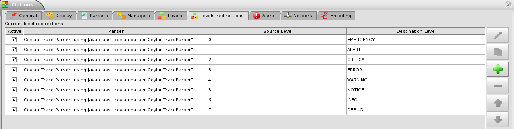

========================================
Technical Manual of the ``Traces`` Layer
========================================

.. role:: raw-html(raw)
   :format: html

.. role:: raw-latex(raw)
   :format: latex

:Author: Olivier Boudeville
:Contact: olivier.boudeville@esperide.com
:Creation Date: Wednesday, August 11, 2010
:Lastly Updated on: Tuesday, July 4, 2017

:Status: Work in progress
:Version: 0.0.5
:Dedication: Users and maintainers of the ``Traces`` layer.
:Abstract:

	The role of the ``Traces`` layer (part of the Ceylan project) is to provide trace services, so that the user can log and browse runtime messages that may be emitted concurrently (in parallel, and in a distributed way).

	We present here a short overview of these Erlang-implemented services, to introduce them to newcomers.

	The next level of information is to read the corresponding source files, which are intensely commented and generally straightforward.

.. meta::
   :keywords: Traces, log, browse, emit, layer

.. comment:
   Cannot be specified here 'Can be used only in preamble.':
   comment:raw-latex:`\usepackage{graphicx}`

:raw-latex:`\pagebreak`

.. contents:: Table of Contents
	:depth: 2

.. section-numbering::

:raw-latex:`\pagebreak`

General Information
===================

This layer is in charge of providing Erlang programs with the means of emitting, collecting, storing and browsing *applicative traces* (i.e. logs).

For that various, components have been designed and implemented, such as trace aggregator, emitter, listener, supervisor, etc.

They collectively constitute the **Traces** layer, whose prerequisite is the **WOOPER** layer (for object-oriented primitives) and the **Common** layer (for many lower-level services).

This main purpose of the **Traces** layer is to provide adequate traces for distributed systems, and to ease their browsing. A few back-ends are available for that, from the direct reading of the trace files to considerably more user-friendly solutions, such as the generation of PDF reports or the use of `LogMX <http://www.logmx.com/>`_.

This layer defined a trace format of its own, supported by our Java-based parser for LogMX.

.. Note::
  In some cases, it may be convenient to have one's debugging traces be directly output on the console.

  Then, once the basic bugs are fixed (ex: the program is not crashing anymore), the full power of this ``Traces`` layer can then be best used by switching these first, basic traces to the more advanced traces presented here.

  To output (basic) console traces, one may use the ``trace_utils`` module of the ``Common`` layer; ex: ``trace_utils:debug_fmt( "Hello world #~B", [ 2 ] )``.

  Then switching to the mainstream, more advanced traces is just a matter of replacing, for a trace type T, ``trace_utils:T`` with ``?T``, like in: ``?debug_fmt( "Hello world #~B", [ 2 ] )`` (with no further change in the trace parameters).

Trace Emission
==============

Typically the following include is needed so that an Erlang process can send traces::

  -include("class_TraceEmitter.hrl").

Then sending-primitives can be used, such as::

  ?info("Hello world!")

or::

  ?info_fmt( "The value ~B is the answer.", [MyValue] )

Many API variations exist, to account for the various `trace levels`_, contexts, etc.

The trace macros used above can be fully toggled at build-time, on a per-module basis (if disabled, they incur zero runtime overhead with no source change).

.. _`trace levels`

Trace Levels
============

There are six built-in levels for trace channels, of increasing severity:

===================== ============
Trace Severity        Mapped Level
===================== ============
``debug``             6
``trace``             5
``info``              4
``warning``           3
``error``             2
``fatal``             1
===================== ============

There is also an addition trace severity, ``void``, that designates traces that shall be muted in all cases.

Its purpose is to provide another means of muting/unmuting some tracesn instead of commenting out/uncommenting said traces.

:raw-latex:`\pagebreak`

Trace Format
============

A set of traces is represented as an ordered stream of trace lines.

These traces are possibly exchanged over the network or stored in file, whose extension is conventionally ``.traces``.

For example the traces for a test named ``my_foobar_test`` are typically stored in a ``my_foobar_test.traces`` file, generated by the trace aggregator in the directory from which the corresponding test was launched.

Each trace line is a raw text (hence not a binary content) made of a series of predefined fields, separated by the pipe (``|``) character.

These fields are:

 #. **technical identifier of the emitter**, as a string (ex: ``<9097.51.0>`` for the PID of a distributed Erlang process)
 #. **name of the emitter** (ex: ``"Instance tracker"``)
 #. **dotted categorization of the emitter** (ex: ``"Core.Tracker.Instances"``); here for example the emitter is an element of the service in charge of the instances, which itself belongs to the tracker services, which themselves belong to the core services
 #. **application-level timestamp** (ex: operation count, relative tick, absolute timestep, complex, application-specific timestamp, etc.), possibly ``none`` or ``undefined`` if not applicable (ex: a simulation that would not be started yet)
 #. **wall-clock timestamp**, in the ``"Year/Month/Day Hour:Minute:Second"`` format (ex: ``"2016/6/10 15:43:31"``)
 #. **emitter location**, as a string (ex: the name of the Erlang node, possibly including the name of the application use case, of the user and of the host; ex: ``my_foobar_test_john@hurricane.org``)
 #. **dotted categorization of the trace message** itself (ex: ``MyApplication.MyTopic.SomeTheme``)
 #. **severity of the trace message** (mapped to an integer level)
 #. **trace message** itself, an arbitrary text of arbitrary length, possibly containing any number of instances of the field delimiter

Example of trace line (end of lines added for readability)::

  <0.45.0>|I am a test emitter of traces|TraceEmitter.Test|none|2016/6/13
  14:21:16|traceManagement_run-paul@hurricane.foobar.org|MyTest.SomeCategory|6
  |Hello debug world!

or::

  <9097.51.0>|Instance tracker|Core.Tracker.Instances|14875|2016/6/10
  15:43:31|My_application_case-john@hurricane.foobar.org|
  Execution.Uncategorized|4|Creating a new root instance tracker whose
  troubleshooting mode is enabled.

:raw-latex:`\pagebreak`

Trace Browsing
==============

Traces may be browsed thanks to either of the following supervision solutions (see ``class_TraceSupervisor.erl``):

- ``text_traces``, itself available in two variations:

 - ``text_only`` if wanting to have traces be directly written to disk as pure, yet human-readable, text
 - ``pdf``, if wanting to read finally the traces in a generated PDF file

- ``log_mx_traces``, for LogMX-compliant traces (the default) and discussed below

Indeed the most usual tool that we use for trace browsing is `LogMX <http://www.logmx.com/>`_, which we integrated:

.. image:: logmx-interface.png
		   :scale: 50 %

We implemented a Java-based parser of our trace format for LogMX (see ``CeylanTraceParser.java``):

Traces can be browsed with this tool:

- "live" (i.e. during the execution of the program), either from its start or upon connection to the running program while it is already running [#]_ (see ``class_TraceListener.erl``)
- "post mortem" (i.e. after the program terminated, based on its trace file)

.. [#] In which case the trace supervisor will receive a compressed version of all past traces then all new ones, hence with none lost.

The supervision solution can be switched at compile time (see the ``TraceType`` defined in ``traces/src/traces.hrl``); the ``Traces`` layer shall then be rebuilt.

:raw-latex:`\pagebreak`

Trace Implementation
====================

General Mode of Operation
-------------------------

All processes are able to emit traces, either by using standalone trace sending primitives (mostly for plain Erlang processes), or by inheriting from the ``TraceEmitter`` class, in the (general) case of WOOPER-based processes.

In the vast majority of cases, all these emitters send their traces to a single trace aggregator, in charge of collecting them and storing them on-disk, according to an adequate trace format.

This trace format can be parsed by various trace supervisors, the most popular being `LogMX <http://www.logmx.com>`_.

Various measures have been taken in order to reduce the overhead induced by the overall trace system. Notably traces are sent in a "fire and forget", non-blocking manner (thanks to oneways, which are not specifically acknowledged). The number of messages exchanged is thus reduced, at the cost of a lesser synchronization of the traces (i.e. there is no strong guarantee that the traces will be ultimately displayed in the order of their emission in wallclock-time, as they will be directly stored in their actual order of receiving by the trace aggregator [#]_, with no further reordering).

.. [#] For example, if both the trace aggregator and a process B are running on the same host, and if a process A, running on another host, emits a trace then sends a message to B so that B sends in turn a trace, then the trace from  B *might* in some cases be received - and thus be listed - by the aggregator *before* the trace for A (it depends on the network congestion, relative scheduling of processes, etc.).

Trace Emitters
--------------

When sending a trace, an emitter relies on its ``trace_timestamp`` attribute, and sends a string representation thereof (obtained thanks to the ``~p`` quantifier of ``io:format/2`` ). This allows the trace subsystem to support all kinds of application-specific traces (ex: integers, floats, tuples, strings, etc.).
